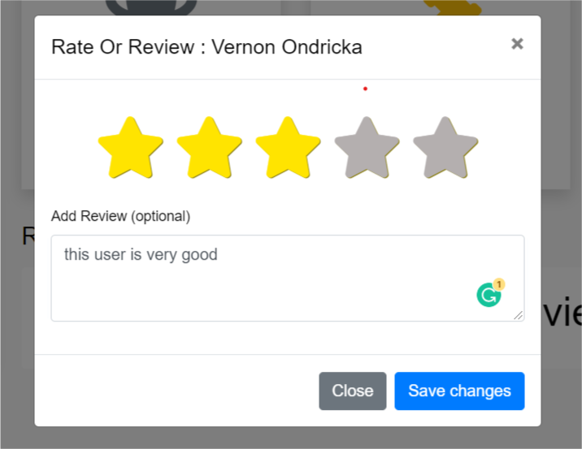

# 

**_Bidding.com_** is a web-based auction system made for handling the full process of an online auction
to provide a user-friendly website for the buyers and sellers to auction their products easily,
handled multi-dynamic roles and contained a dashboard to control the whole system.
it's designed to be an online trading and auction website with real-time communications tools between bidders and owners
by using Laravel 8, Livewire, Websockets.

## Main Features 

- **[Authentication](#Authentication)**
- **[Authorization](#Authorization)**
- **[Profile](#Profile)**
  - [Update Profile](#Update-Profile)
  - [Rate User](#Rate-User)
  - [Reviews](#Reviews)
  - [Reports](#Reports)
- **[Add Product](#Add-Product)**
- **[Bidding](#Bidding)**
  - [Bid Process](#Bid-Process)
  - [Timer Delay](#Timer-Delay)
  - [End Bidding](#End-Bidding)
  - [Likes](#Likes)
  - [Comments and Replies](#Comments-and-Replies)
- **[Search and Filtering](#Search-and-Filtering)**
- **[Notifications](#Notifications)**
- **[Dashboard](#Dashboard)**
  - [Block User](#Block-User)
  - [Stop Product](#Stop-Product)
  - [Return Product](#Return-Product)

## Contributors
> Thanks goes to these wonderful people in the team.
<table>
  <tr>
    <td align="center">
    <a href="https://github.com/aminyasser" target="_black">
    
     
    <b>Amin</b></a>
     
    </td>
    <td align="center">
    <a href="https://github.com/mahmoud-adel44" target="_black">
    
     
    <b>Mahmoud Adel</b></a>
     
    </td>
    <td align="center">
    <a href="https://github.com/MohamedWalid0" target="_black">
    
     
    <b>Mohamed Walid</b></a>
     
    </td>
  </tr>
 </table>

## Authentication

User can Register with Facebook,Twitter or GitHub , or normal Register with the data needed for 
Register like Email, Phone, Location etc, There is a Verification Layer, The email and phone must be vrefy before access 
to profile or add bid on a product. 
And User can Login with email/password or with Facebook,Twitter,GitHub.

## Authorization

We have many roles ``Admin`` ``Moderator`` ``Support Team`` ``User`` , and admin can add a new role 
with different permission and assign this role to any user then user will have some of different permission. 
also you can edit current Role.

## Profile
In Profile Module you can access your data and update it, see your Reviews, see the products you bid on. 
you can rate and review other user, and report user, see other user reviews section.

### Update Profile

User can edit his profile or profile image.

  
  

 

### Rate User

User can edit his profile or profile image or add additional Review on his Rate.

### Reviews

Display User Reviews

### Reports

User can Report Product or User and the admin can see all reports in dashboard and stop product or ban user.

## Add Product

System ask about Product details like ``name`` ``images`` ``descreption`` ``location`` 
``start price`` ``category`` ``sub-category`` ``deadline``

## Bidding

The bidding, User can add bid on the product and see the other bidders in real-time with livewire and websockets,
and get notification when any bid get added. 
You can also like product, comment, reply comment if you are the product owner.

### Bid Process 
The real-time change when the user add a bid.

https://user-images.githubusercontent.com/64032541/155890495-e184f1ad-f222-4b15-841d-829457b01588.mp4

### Time Delay

In our Requirements, we assume that when the user add a bid in the last hour, the deadline must delay one hour
to make sure that all other users get the notifications

https://user-images.githubusercontent.com/64032541/155890518-8e4397ba-53d9-423e-8284-d69ac0e06a7c.mp4

### End Bidding
The real-time change when the deadline come.

https://user-images.githubusercontent.com/64032541/155890542-171897af-dbe9-493a-85c6-adc6746d1d21.mp4
### Likes

User can like/dislike Product or Comment.

### Comments and Replies
Any User can add comment on product, but only the product owner can reply on comment.

## Search and Filtering

System provide real-time Search for products via navbar search input or search and filtering page.

## Notifications
There is many types of notifications 
- Email NotificationsAdmin can send notification to all users or specific user by email.
- Normal Real-time navbar notification when user add bid on product all the bidders and product owner get notified.

## Dashboard

The project dashboard can control the whole system, block users, stop product, modify roles, and control all project.

### Block User

Admin can block any user and this user can't Login again.

### Stop Product
when admin see that product has many reports, The admin can stop it and the product change in real-time.

https://user-images.githubusercontent.com/64032541/155890586-59ae8456-814e-4de5-b4fa-d4e927ab1433.mp4

### Return Product
The admin can return the product and make it open again.

https://user-images.githubusercontent.com/64032541/155890622-6ce8a58b-0a39-4f53-8f6e-f788f9100edc.mp4

